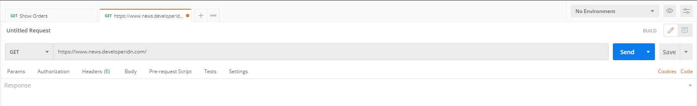
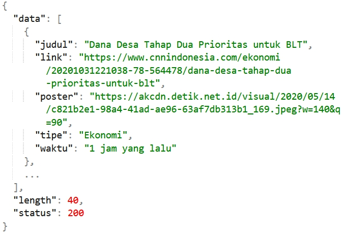

# Tutorial React Native
Tutorial membuat aplikasi mobile dengan menggunakan React Native Expo


## Modul 5 - Fetch API pada React Native
Pada modul ini akan dijelaskan bagaimana cara mengonsumsi API menggunakan fetch mdn.

## Tentang API
API adalah akronim dari *Application Programming Interface* dimana memungkinkan pengembang untuk mengkomunikasikan dua bagian dari satu aplikasi yang sama atau aplikasi yang berbeda secara bersamaan. Disini kita akan menggunakan web api yang dapat diakses melalui protokol *http*. Singkatnya nanti ada suatu data yang disediakan oleh server yang dapat diakses secara publik dengan *http request*.

## Tentang JSON
<!-- Todo -->

## Persiapan Project
Sebelum memulai modul ini pastikan kebutuhan dibawah ini telah terpenuhi.
- [Postman] https://www.postman.com/downloads/ (untuk menguji respon API)

kita akan menggunakan api cnn indonesia (*unofficial*) https://github.com/rizki4106/cnnindonesia-news-api dan modul ini menggunakan index semua berita.

## Fetch API
1. Memeriksa respon dengan postman

    Tahap ini diperlukan untuk mendapatkan respon - respon yang kita perlukan (dimana nantinya yang akan ditampilkan di aplikasi). Pertama buka aplikasi postman yang sudah diinstall kemudian masukkan requestnya seperti berikut.
    
    

    Lalu tekan send dan akan menghasilkan *response* pada bagian bawah postman, bentuk *response* nya akan seperti berikut.

    

    Penting untuk diperhatikan, dari *response* diatas diambil field data yang memiliki bentuk *array* dari *object* berita. *Object* berita sendiri terdiri dari judul, link, poster, tipe, dan waktu (kita tidak mengambil link). 

2. Pembuatan fetch api

    Setelah mengetahui bentuk *response* nya, selanjutnya dibuat request api pada react native. Rubah isi dari app.js menjadi seperti berikut.
    
    ### Class
    ```javascript
    import { StatusBar } from 'expo-status-bar';
    import React from 'react';
    import { FlatList, Image, SafeAreaView, StyleSheet, Text, TouchableOpacity, View } from 'react-native';

    const BASE_URL = "https://www.news.developeridn.com/";

    export default class App extends React.Component {

        constructor(){
            super();
            this.state = {
            newsData: {}
            };
        }

        componentDidMount() {
            this.getAllNews();
        }

        getAllNews() {
            fetch(BASE_URL)
                .then((response) => response.json())
                .then((json) => this.setState({
                    newsData: json
                })
                )
                .catch((error) => console.log(error));
        }

        render() {
            const {newsData} = this.state;

            return(
                <SafeAreaView style={styles.container}>
                    <StatusBar backgroundColor={'#ffffff'} />
                    <FlatList
                        data={newsData.data}
                        style={styles.listStyle}
                        keyExtractor={(item, index) => (`${item}--${index}`)}
                        renderItem={({item}) => (
                        <TouchableOpacity onPress={() => {}} style={styles.customCard}>
                            <View style={{
                            flex: 1, 
                            flexDirection: "row", 
                            justifyContent: "center",
                            alignItems: "center"}}>
                            <Image 
                                style={styles.tinyLogo}
                                source={{
                                    uri: item.poster
                                }}/>
                            <View style={styles.rightContainer}>
                                <View style={styles.head}>
                                <Text style={{
                                    fontSize: 12
                                }}>Kategori</Text>
                                <Text style={{
                                    fontSize: 12
                                }}>{item.tipe}</Text>
                                </View>
                                <Text 
                                style={{flex: 1, flexWrap: "wrap"}}
                                numberOfLines={2} 
                                ellipsizeMode={"tail"}>
                                {item.judul}
                                </Text>
                                <Text 
                                style={{
                                    flex: 1, 
                                    flexWrap: "wrap",
                                    fontSize: 12,
                                    color: 'gray'}}
                                numberOfLines={2} 
                                ellipsizeMode={"tail"}>
                                {item.waktu}
                                </Text>
                            </View>
                            </View>
                        </TouchableOpacity>
                        )}
                    />
                </SafeAreaView>
            );
        }
    }
    ```
    <!-- Todo penjelasan -->

        
    ### Functional
    ```javascript
    export default function App() {
        const [newsData, setNewsData] = React.useState({});

        const getAllNews = async () => {
            try {
            let response = await fetch(
                BASE_URL, {
                method: 'GET',
                mode: 'cors',
                credentials: 'same-origin',
                Vary: 'Origin',
                headers: {
                    'Access-Control-Allow-Origin': 'https://www.news.developeridn.com/',
                }
                });
            let jsonData = await response.json();
            // console.log(jsonData.data);
            setNewsData(jsonData);
            } catch (error) {
            console.log(error);
            }
        };

        React.useEffect(() => {
            getAllNews();
        });

        return (
            <SafeAreaView style={styles.container}>
                <StatusBar backgroundColor={'#ffffff'} />
                <FlatList
                    data={newsData.data}
                    style={styles.listStyle}
                    keyExtractor={(item, index) => (`${item}--${index}`)}
                    renderItem={({item}) => (
                        <TouchableOpacity onPress={() => {}} style={styles.customCard}>
                        <View style={{
                            flex: 1, 
                            flexDirection: "row", 
                            justifyContent: "center",
                            alignItems: "center"}}>
                            <Image 
                                style={styles.tinyLogo}
                                source={{
                                uri: item.poster
                                }}/>
                            <View style={styles.rightContainer}>
                            <View style={styles.head}>
                                <Text style={{
                                fontSize: 12
                                }}>Kategori</Text>
                                <Text style={{
                                fontSize: 12
                                }}>{item.tipe}</Text>
                            </View>
                            <Text 
                                style={{flex: 1, flexWrap: "wrap"}}
                                numberOfLines={2} 
                                ellipsizeMode={"tail"}>
                                {item.judul}
                            </Text>
                            <Text 
                                style={{
                                flex: 1, 
                                flexWrap: "wrap",
                                fontSize: 12,
                                color: 'gray'}}
                                numberOfLines={2} 
                                ellipsizeMode={"tail"}>
                                {item.waktu}
                            </Text>
                            </View>
                        </View>
                        </TouchableOpacity>
                    )}
                    />
            </SafeAreaView>
        );
    }
    ```
    <!-- Todo penjelasan -->


    ### Style
    ```css
    const styles = StyleSheet.create({
        container: {
            backgroundColor: '#fff',
            marginTop: 4,
        },
        customCard: {
            elevation: 2,
            borderRadius: 5,
            paddingHorizontal: 8,
            paddingVertical: 5,
            marginHorizontal: 10,
            marginVertical: 5,
            flexDirection: "row",
            alignSelf: "baseline"
        },
        rightContainer: {
            flexDirection: "column",
            flex: 1
        },
        tinyLogo: {
            width: 60,
            height: 60,
            marginRight: 5,
            flex: 0
        },
        head: {
            flexDirection: "row",
            justifyContent: "space-between",
        },
        mainContainer: {
            paddingTop: 50
        },
        listStyle: {
            marginTop: 30
        }
    });
    ```
    <!-- Todo penjelasan -->

    ### Hasil akhir
    Hasil dari modul ini akan seperti berikut.
    

## Pustaka
- (Daftar API publik) https://github.com/farizdotid/DAFTAR-API-LOKAL-INDONESIA
- (React Native Networking) https://reactnative.dev/docs/network/
- https://reactnative.dev/docs/flatlist/

***
Mobile Innovation Studio - 2020
