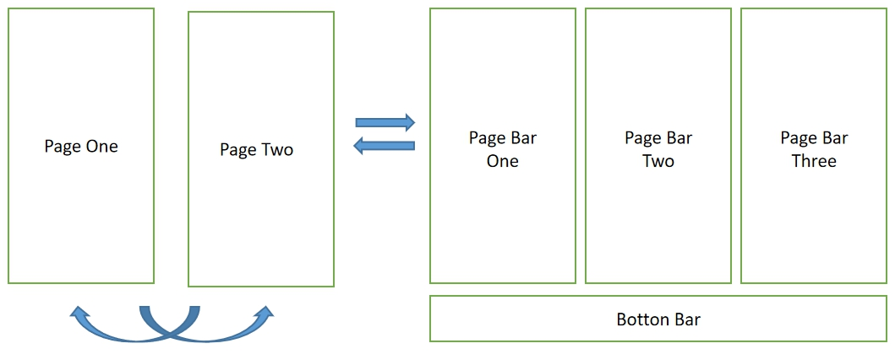
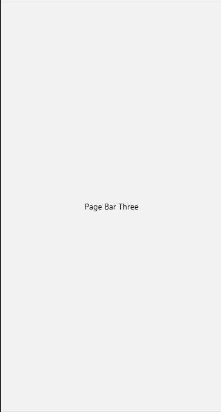
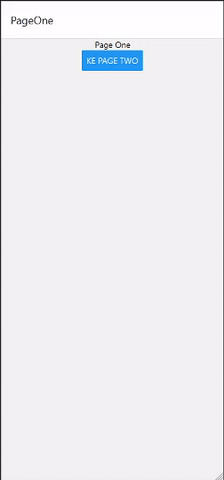

# Tutorial React Native
Tutorial membuat aplikasi mobile dengan menggunakan React Native Expo


## Modul 4 - Navigasi pada React Native
Pada modul ini akan dijelaskan bagaimana cara melakukan navigasi dalam project React Native menggunakan React Navigation.


### Jenis - Jenis Navigasi
Dalam melakukan perpindahan layar antara layar satu dengan yang lain, React Navigation menawarkan 3 jenis navigasi. 

1. Stack Navigator  
    <video src="https://reactnavigation.org/assets/navigators/stack/stack.mov" height="450px" autoplay loop>
2. Drawer Navigator  
    <video src="https://reactnavigation.org/assets/navigators/drawer/drawer.mov" height="450px" autoplay loop>
3. Tab Navigator (bottom tab dan top tab)  
    <video src="https://reactnavigation.org/assets/navigators/tabs/bottom-tabs-demo.mov" height="450px" autoplay loop>

Dari ketiga jenis navigasi di atas, untuk saat ini materi pada modul ini akan membahas tentang Stack Navigation dan Bottom Tab Navigator.


### Instalasi Library
Sebelum memulai membuat navigasi, diperlukan instalasi library dengan menjalankan perintah pada command prompt (Windows) atau terminal seperti berikut.
> Catatan :  
> Modul ini membahas instalasi React Navigation pada project Expo Managed Workflow. 
> Untuk project Bare Workflow, silakan melihat dokumentasi React Navigation pada [link berikut](https://reactnavigation.org/docs/getting-started/#installing-dependencies-into-a-bare-react-native-project).

-   Pertama, jalankan perintah berikut untuk menginstall library inti
    ```shell script
    npm install @react-navigation/natives
    ```

-   Kemudian ketikkan perintah berikut untuk menginstal dependensi yang diperlukan oleh React Navigation
    ```shell script
    expo install react-native-gesture-handler react-native-reanimated react-native-screens react-native-safe-area-context @react-native-community/masked-view
    ```

-   Pada navigasi utama digunakan sejenis stack, sehingga install dependensi Stack Navigator dengan mengetikkan perintah.
    ``` shell script
    npm install @react-navigation/stack
    ```
-   Selain navigasi utama, apabila ingin menggunakan navigasi Bottom Tab diperlukan sebuah library lagi dengan perintah berikut.
    ```
    npm install @react-navigation/bottom-tabs
    ```


### Persiapan Project
Sebelum memulai membuat navigasi, hal yang paling utama adalah membuat screen atau layar yang akan dituju.  
Sehingga pertama buat sebuah folder bernama page, lalu buat 5 file pada folder tersebut bernama :  

- pageOne.js
- pageTwo.js
- pageBarContainer.js
- pageBarOne.js
- pageBarTwo.js
- pageBarThree.js

Alur dari project ini nanti akan seperti berikut :  

  

Lalu isi setiap file yang sudah kita buat sebelumnya seperti berikut.  

1.  Halaman pageOne.js  
    Kode : 
    ```javascript
    // pageOne.js

    import React from 'react';
    import {View, Text, Button} from 'react-native';

    class PageOne extends React.Component {    
        render() {
            const {navigation} = this.props;
            return(
                <View style={{
                    display: "flex", 
                    justifyContent: "center", 
                    alignItems: "center"
                    }}>
                    <Text>Page One</Text>
                    <Button
                        title={"Ke Page Two"}
                        onPress={() => navigation.navigate("PageTwo")}
                    />
                </View>
            );
        }
    }

    export default PageOne;
    ```

    Tampilan :   

      

2.  Halaman PageTwo  
    Kode : 
    ```javascript
    // pageTwo.js

    import React from 'react';
    import {View, Text, Button} from 'react-native';

    class PageTwo extends React.Component {
        render() {
            const { navigation } = this.props;
            return(
                <View  style={{
                    display: "flex", 
                    justifyContent: "center", 
                    alignItems: "center"
                    }}>
                    <Text style={{marginBottom: 16}}>Page Two</Text>
                    <Button
                        title={"Ke Page Bottom Bar"}
                        onPress={() => navigation.navigate("BottomBarContainer")}/>
                    <View style={{marginVertical: 8}}></View>
                    <Button
                        title={"Ke Page One"}
                        onPress={() => navigation.goBack()}/>
                </View>
            );
        }
    }

    export default PageTwo;
    ```

    Tampilan :   

      

3.  Halaman PageBarOne, PageBarTwo, PageBarThree. Contoh PageBarThree :  
    Kode : 
    ```javascript
    // pageBarThree.js

    import React from 'react';
    import {View, Text} from 'react-native';

    class PageBarThree extends React.Component {
        render() {
            return(
                <View style={{
                    display: "flex",
                    justifyContent: "center",
                    alignItems: "center",
                    width: '100%',
                    height: '100%'
                }}>
                    <Text>Page Bar Three</Text>
                </View>
            );
        }
    }

    export default PageBarThree;
    ```

    Tampilan :   

      


### Membuat navigasi
Setelah membuat beberapa layar, selanjutnya adalah menghubungkan layar-layar tersebut dengan navigasi. Untuk caranya :

1.  Pertama-tama kita buat file app.js sebagai entry point dari alur. Pada dasarnya navigasi pada aplikasi mobile berbentuk stack (first in last out) sehingga semakin dalam kita menuju ke halaman tertentu maka akan banyak halaman yang dilewati untuk menuju dan kembali ke awal. Pada react digunakan stackNavigator dan NavigationContainer dalam implementasi hal ini, berikut implementasinya.  
    
    ```javascript
    import { StatusBar } from 'expo-status-bar';
    import React from 'react';
    import { StyleSheet, Text, View } from 'react-native';
    import { NavigationContainer } from '@react-navigation/native';
    import { createStackNavigator } from '@react-navigation/stack';
    // Page
    import PageOne from './page/pageOne';
    import PageTwo from './page/pageTwo';
    import PageBarContainer from './page/pageBarContainer';

    const Stack = createStackNavigator();

    export default function App() {
        return (
            <NavigationContainer>
            <Stack.Navigator>
                <Stack.Screen name="PageOne" component={PageOne}/>
                <Stack.Screen name="PageTwo" component={PageTwo}/>
                <Stack.Screen name="BottomBarContainer" component={PageBarContainer}/>
            </Stack.Navigator>
            </NavigationContainer>
        );
    }

    ```

    > `createStackNavigator` adalah fungsi yang mengembalikan objek dengan 2 properti, `Screen` dan `Navigator` dimana navigator untuk melakukan operasi di stack nya sedangkan screen sebagai element.  

    > `NavigationContainer` adalah komponen untuk manajemen pohon navigasi kita dan berisi navigation state. Isi dari Navigator adalah halaman - halaman yang akan kita sambung satu sama lain (secara otomatis halaman tersebut memiliki props navigation)

2.  Selanjutnya kita buat file pageBarContainer.js sebagai container (wadah) dari navigasi bottom tab yang terdiri dari 3 halaman pageBar yang sudah kita buat diatas.  
    Berikut implementasinya.  

    ```javascript
    import React from 'react';
    import { View, Text } from 'react-native';
    import { createBottomTabNavigator } from '@react-navigation/bottom-tabs';
    // Page
    import PageBarOne from './pageBarOne';
    import PageBarTwo from './pageBarTwo';
    import PageBarThree from './pageBarThree';

    const Tab = createBottomTabNavigator()

    class PageBarContainer extends React.Component {
        render() {
            return(
                <Tab.Navigator
                    activeColor="#f0edf6"
                    inactiveColor="#3e2465">
                    <Tab.Screen name={"Home"} component={PageBarOne}/>
                    <Tab.Screen name={"Second"} component={PageBarTwo}/>
                    <Tab.Screen name={"Third"} component={PageBarThree}/>
                </Tab.Navigator>

            );
        }
    }

    export default PageBarContainer;
    ```

    > TabNavigator memiliki konsep yang sama dengan StackNavigator hanya berbeda fungsi saja. Setelah mengatur dua file tersebut maka output dari kode kita akan seperti berikut.  

    


### Pustaka
- [Getting Started - React Navigation Documentation](https://reactnavigation.org/docs/getting-started/)
- [createStackNavigator - React Navigation Documentation](https://reactnavigation.org/docs/stack-navigator)
- [createBottomTabNavigator - React Navigation Documentation](https://reactnavigation.org/docs/bottom-tab-navigator)


***
Mobile Innovation Studio - 2020

