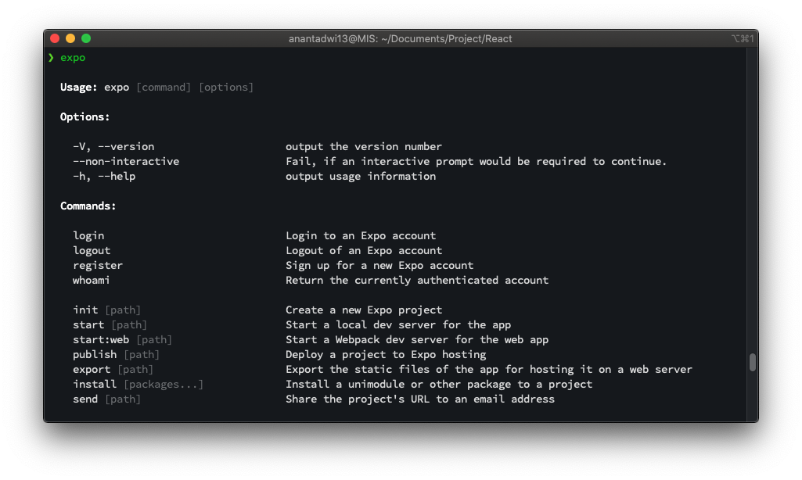

# Tutorial React Native
Tutorial membuat aplikasi mobile dengan menggunakan React Native Expo

## Modul 4 - Navigasi pada React Native
Pada modul ini akan dijelaskan bagaimana cara melakukan navigasi antar project React Native menggunakan 
Expo Managed Workflow.

### Pra - Instalasi
Berikut link dokumentasi dari library react navigation

1.  https://reactnavigation.org/docs/getting-started

### Instalasi Library
Sebelum memulai membuat navigasi, diperlukan instalasi library dengan perintah pada command prompt (Windows) atau terminal seperti berikut.

- Melalui link pada pra instalasi, jalankan perintah berikut 
```shell script
npm install expo install react-native-gesture-handler react-native-reanimated react-native-screens react-native-safe-area-context @react-native-community/masked-view --global expo-cli
```
Selanjutnya, untuk mengetahui proses instalasi berhasil. Jalankan perintah berikut.
```shell script
expo
```
Akan muncul daftar perintah expo-cli seperti gambar di bawah yang menandakan expo-cli berhasil diinstal.  


### Pustaka
- [Installation - Expo Documentation](https://docs.expo.io/get-started/installation/)
- [Create a new app - Expo Documentation](https://docs.expo.io/get-started/create-a-new-app/)
***
Mobile Innovation Studio - 2020

