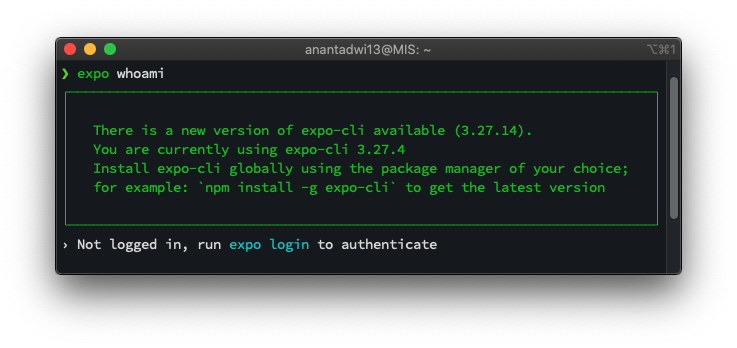
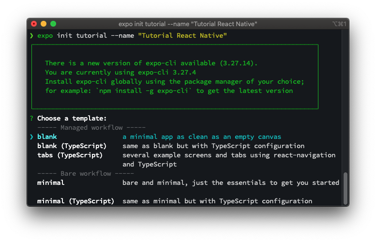
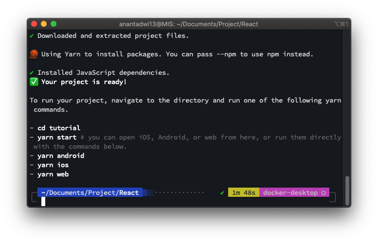

# Tutorial React Native
Tutorial membuat aplikasi mobile dengan menggunakan React Native Expo

## Modul 2 - Instalasi, Membuat, dan Menjalankan Project React Native

Pada modul ini akan dijelaskan bagaimana cara instalasi, membuat, dan menjalankan project React Native menggunakan 
Expo Managed Workflow.

### Pra-instalasi
Sebelum memulai instalasi React Native Expo, pastikan kebutuhan-kebutuhan di bawah ini telah terpenuhi.
- [Node.js](https://nodejs.org/en/)
- [Git](https://git-scm.com/)
- [Watchman](https://facebook.github.io/watchman/docs/install#buildinstall) (untuk pengguna macOS)
- [Yarn](https://yarnpkg.com/getting-started/install) (opsional), alternatif package manager selain npm 

### Instalasi React Native
Setelah memenuhi kebutuhan di atas. Selanjutnya dapat menjalankan perintah berikut pada command prompt (Windows) atau terminal
untuk menginstall React Native Expo CLI.
```shell script
npm install --global expo-cli
```
Selanjutnya, untuk mengetahui proses instalasi berhasil. Jalankan perintah berikut.
```shell script
expo whoami
```
Akan muncul informasi versi expo-cli seperti gambar di bawah yang menandakan expo-cli berhasil diinstal.  



### Membuat Project React Native
Dalam membuat project baru, ada beberapa template yang dapat digunakan seperti yang telah dibahas pada modul 1. Modul ini 
hanya berfokus pada pembuatan project React Native Expo Managed Workflow.
1. Jalankan perintah berikut.
   ```shell script
   expo init nama-project --name "Nama Aplikasi"
   ```
   `nama-project` adalah nama folder dari project yang dibuat, sedangkan  
   `--name "Nama Aplikasi"` adalah nama aplikasi yang akan ditampilkan di home screen.
2. Selanjutnya akan diberi pilihan template seperti gambar di bawah. Dapat dilihat terdapat 2 jenis template yaitu `Managed 
   workflow` dan `Bare workflow`.  Di dalamnya juga terdapat 2 macam yaitu tanpa TypeScript dan dengan TypeScript.  
   Untuk saat ini pilih template `blank` tanpa TypeScript pada `Managed workflow`.   
   
   > TypeScript merupakan perkembangan dari JavaScript yang memberikan fitur keterangan tipe data dari variable yang dibuat.
3. Tunggu proses instalasi dependensi JavaScript.
4. Akan muncul keterangan seperti gambar berikut yang menandakan pembuatan project selesai.
   
   

### Menjalankan React Native
Setelah membuat project baru, terdapat banyak cara untuk menjalankan React Native di perangkat Android/iOS baik itu 
real device maupun simulator.

#### Menjalankan Expo DevTools (Wajib)  
Pastikan Expo DevTools berjalan sebelum melanjutkan ke tahap berikutnya.  
1. Masuk ke direktori project React Native.
   ```shell script
   cd nama-project
   ```
2. Jalankan Expo DevTools.
   ```shell script
   npm run start
   
   # Jika menggunakan yarn
   yarn start
   ```
3. Akan muncul tab browser baru yang merupakan GUI dari Expo DevTools.
   
   
#### Menjalankan Aplikasi di Simulator Android atau Real Device Android via ADB (Wired)
Pastikan simulator Android telah terpasang atau Device Android telah disambungkan ke PC (dengan syarat ADB telah terpasang).
Selanjutnya cukup klik `Run on Android device/emulator` untuk menjalankan aplikasi.

#### Menjalankan Aplikasi di Real Device Android/iOS via aplikasi Expo (Wireless)
>Syarat : Device Android/iOS dan PC dalam satu jaringan WiFi yang sama 
1. Download aplikasi Expo di PlayStore atau AppStore.
2. Buka aplikasi Expo dan pilih `Scan QR Code`.
3. Scan QR Code yang ditampilkan oleh Expo DevTools.  


### Pustaka
- [Installation - Expo Documentation](https://docs.expo.io/get-started/installation/)
- [Create a new app - Expo Documentation](https://docs.expo.io/get-started/create-a-new-app/)

***
Mobile Innovation Studio - 2020
