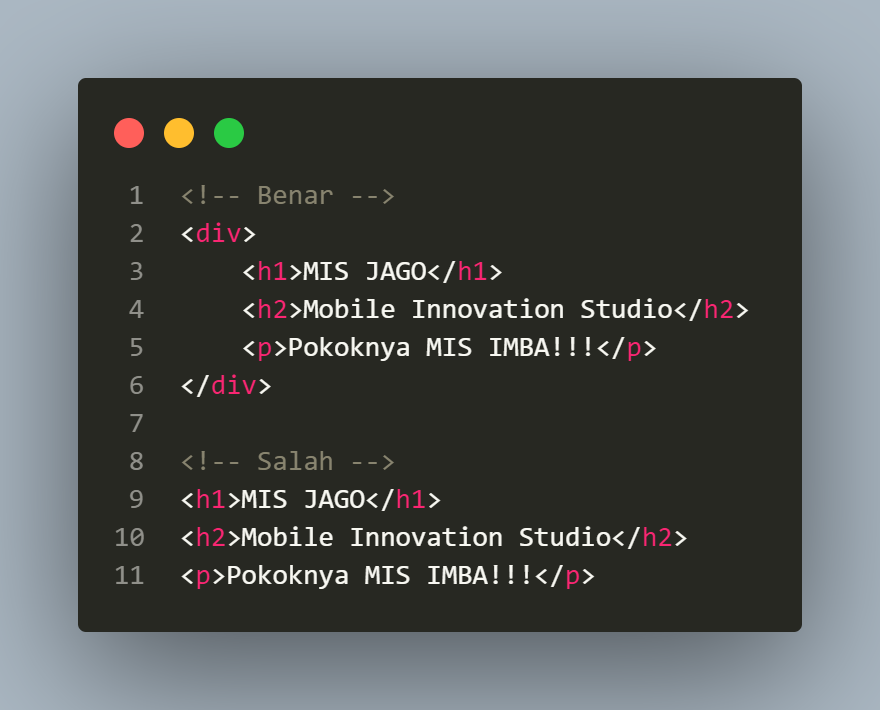
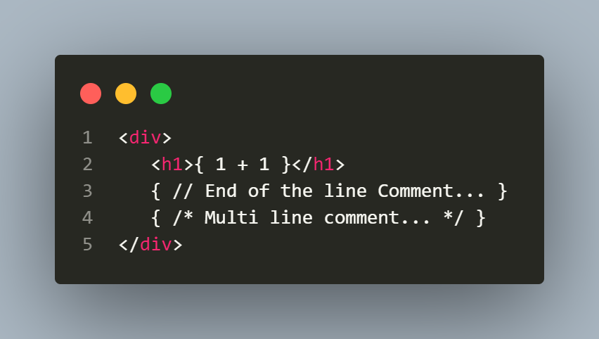
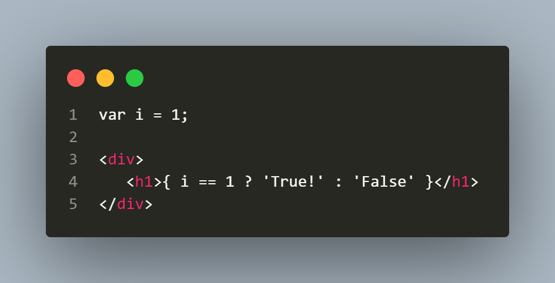
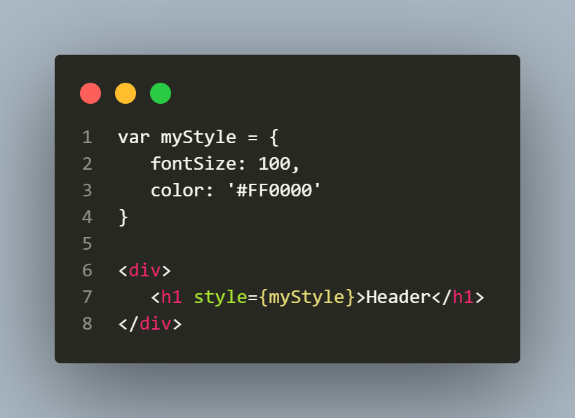
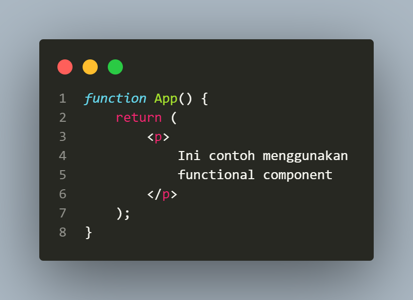
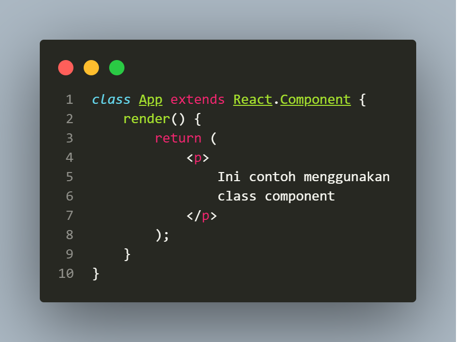
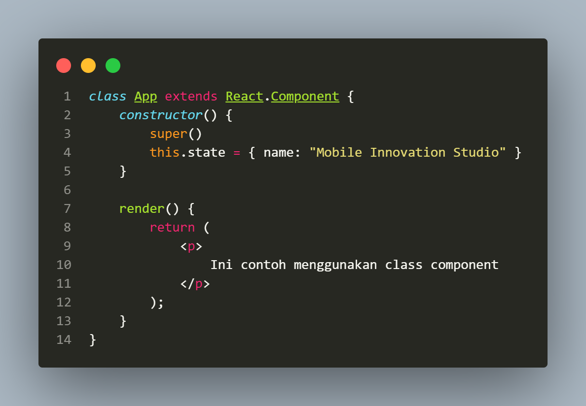

# Tutorial React Native
Tutorial membuat aplikasi mobile dengan menggunakan React Native Expo

***
## JSX
JSX atau bisa dibilang extended javascript adalah suatu pengembangan javascript dimana kode HTML bisa di ikut sertakan dalam javascript. Beberapa rekomendasi dalam JSX sebagai berikut :
- Kode HTML harus nested. Artinya harus ada 1 tag parent

- Penulisan kode Javascript menggunakan {}

- Penulisan if else

- CSS styling

- Penulisan component react diawali huruf kapital. **TIDAK** disarankan mencoba ini
```html
<Header />
```

***
## Rendering
Rendering sangat berkaitan dengan `lifecycle React`. Metode render harus mengembalikan komponen Asli Bereaksi (elemen JSX) ke render (atau null, untuk tidak menghasilkan apa pun).
***
## Components
Komponen adalah bagian-bagian yang menyusun aplikasi. Diharus membuat komponen untuk memberitahu React tentang apa saja yang harus ditampilkan (render) ke Real DOM (HTML). [Apa itu DOM?](https://www.w3schools.com/js/js_htmldom.asp). Komponen di React sendiri bersifat `reuseable`, artinya bisa digunakan kembali.
***
### Jenis Komponen
Komponen yang dibuat dengan fungsi disebut juga dengan `function components` dan yang menggunakan class disebut `class components`. Nama komponen harus dimulai dengan huruf kapital. Fungsi harus mengembalikan JSX elemen.

Sedangkan untuk class component, cara membuatnya harus melakukan extends dari class React.Component. Nama komponen harus dimulai dengan huruf kapital. Method render harus mengembalikan JSX elemen.

Kedua komponen di atas sebenarnya sama, bedanya di cara pembuatannya saja. Komponen pertama dibuat menggunakan fungsi dan komponen kedua menggunakan class.<br>
Pada class component, terdapat method khusus yang akan dijalankan saat class tersebut dibuat. Method tersebut adalah method constructor. Konstruktor biasanya digunakan untuk melakukan inisialisasi komponen. Konstruktur dibuat dengan fungsi `constructor()`. Di dalam konstruktor, kita bisa mendefinisikan nilai awal untuk variabel maupun state. Pemanggilan fungsi `super()` di dalam konstruktor akan mengeksekusi konstruktor dari induk class, yakni `React.Component`. Tujuannya agar kita bisa mengakses semua method yang ada di class induk.

***
## Props
Props adalah sebuah properti atau karakteristik yang bisa diberikan di sebuah komponen/component. Props sendiri biasanya ditulis di dalam sebuah component tag, dengan nama props tertentu. Untuk lebih jelasnya, berikut adalah contoh penggunaan props di component <Greetings/>, dimana propsnya adalah name.

Untuk memanggil props sendiri, kita tinggal pointer-kan, misal nama propsnya adalah name, maka props.name akan memanggil properti nama dari komponen tersebut.
***
## State
***
## Lifecycle
***
## Handling Event
***

Mobile Innovation Studio - 2020
