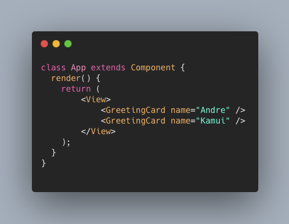
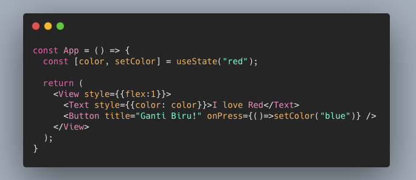
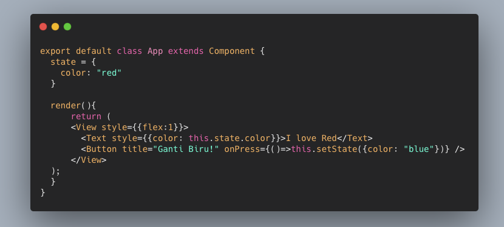
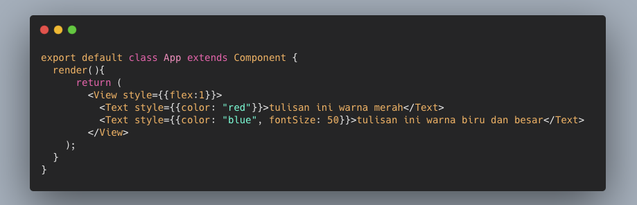
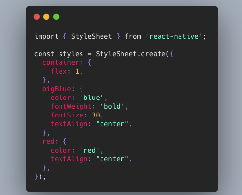
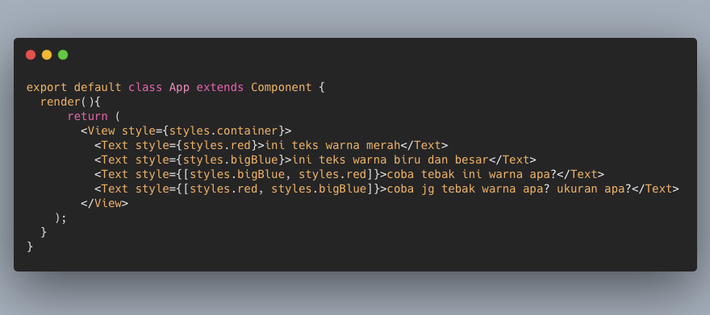
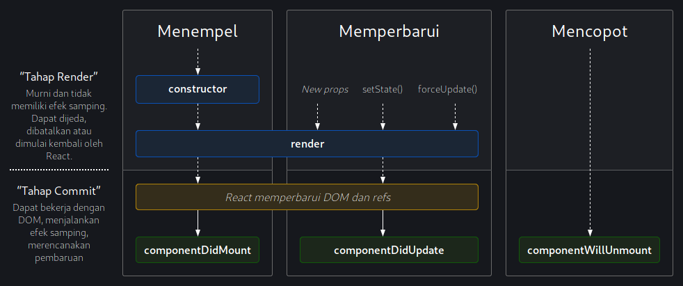

# Tutorial React Native
Tutorial membuat aplikasi mobile dengan menggunakan React Native Expo

## Modul 3 - JSX, Rendering, Component, Props, State, Styling, Lifecycle, dan Handling Event

***
### JSX
JSX atau bisa dibilang JavaScript XML adalah suatu pengembangan javascript dimana kode HTML bisa diikutsertakan dalam javascript. Beberapa rekomendasi dalam JSX sebagai berikut :
- Kode HTML harus nested. Artinya harus ada 1 tag parent  
      
- Penulisan kode Javascript menggunakan {}  
      
- Penulisan if else  
      
- CSS styling  
      
- Penulisan component react diawali huruf kapital. **TIDAK** disarankan mencoba ini
    ```html
    <Header />
    ```


***
### Rendering
Rendering sangat berkaitan dengan `lifecycle React`. Metode render harus mengembalikan komponen Asli Bereaksi (elemen JSX) ke render (atau null, untuk tidak menghasilkan apa pun).


***
### Components
Komponen adalah bagian-bagian yang menyusun aplikasi. Diharuskan membuat komponen untuk memberitahu React tentang apa saja yang akan ditampilkan (render) ke Real DOM (HTML). [Apa itu DOM?](https://www.w3schools.com/js/js_htmldom.asp). Komponen di React sendiri bersifat `reuseable`, artinya bisa digunakan kembali.

#### Jenis Komponen
Terdapat dua jenis komponen, yaitu :
1.  Function Components  
    Komponen yang dibuat dengan fungsi disebut juga dengan `function components` dan yang menggunakan class disebut `class components`. Nama komponen harus dimulai dengan huruf kapital. Fungsi harus mengembalikan JSX elemen.  

      

2.  Class Components
    Sedangkan untuk class component, cara membuatnya harus melakukan extends dari class React.Component. Nama komponen harus dimulai dengan huruf kapital. Method render harus mengembalikan JSX elemen.  

      

Kedua komponen di atas sebenarnya sama, bedanya hanya terletak di cara pembuatannya saja. Komponen pertama dibuat menggunakan fungsi dan komponen kedua menggunakan class.  

Pada class component, terdapat method khusus yang akan dijalankan saat class tersebut dibuat. Method tersebut adalah method `constructor`. Konstruktor biasanya digunakan untuk melakukan inisialisasi komponen. Konstruktor dibuat dengan fungsi `constructor()`. Di dalam konstruktor, kita bisa mendefinisikan nilai awal untuk variabel maupun state. Pemanggilan fungsi `super()` di dalam konstruktor akan mengeksekusi konstruktor dari induk class, yakni `React.Component`. Tujuannya agar kita bisa mengakses semua method yang ada di class induk.

  


***
### Props
React Native memiliki dua tipe data yang dapat mengkontrol sebuah `component`. `props` ditetapkan oleh `parent` dari suatu `component` tersebut dan tidak dapat diperbaiki / diganti (bersifat *fixed* atau *immutable*) selama masa pakai komponen. Bisa dibilang `props` adalah parameter default dari suatu `component`.  

Berikut contohnya:   
-   Pertama kita buat reuseable `component` dengan default props `name`.  
      

-   Lalu akan kita gunakan seperti ini:   
      
    Parameter `name` pada component `<GreetingCard />` adalah sebuah `props`.


***
### State
Jika `props` bersifat *fixed* atau tidak dapat dirubah *value*nya. `state` adalah data control di dalam component yang dapat diubah.  

Deklarasi `state` dalam sebuah Functional Component seperti ini :  
  

Deklarasi `state` dalam sebuah Class Component seperti ini :  
  

Dalam program tersebut sebuah tombol akan memerintah fungsi mengganti isi dari sebuah state.  


***
### Styling
Di dalam React, styling sangat mudah diimplementasikan. Jenis - jenis style pada React sendiri mirip seperti HTML, hanya saja penamaannya menggunakan gaya penulisan *camel case*. Styling di React Native terdapat dua cara.   
-   Pertama, dengan cara langsung dituliskan dalam props component.  
      
    Component utama (core) dari React Native pasti memiliki props `style`.  

-   Kedua, menggunakan `StyleSheet` component. Untuk caranya sebagai berikut.  
    Buat `styles` seperti gambar di bawah  
      

    Untuk pemakaiannya seperti gambar di bawah  
      

    Dua kode di atas diletakkan dalam satu file, jika ingin menjadikannya sebuah file `styles.js` sendiri maka tambahkan `export` ke konstanta `styles` :     
    ```js
    export const styles = StyleSheet.create({
        ...
    });
    ```


***
### Lifecycle

Selain melakukan _rendering_, komponen juga bisa memiliki daur hidup (_lifecycle_) yang dapat dimanfaatkan. Dalam penulisannya juga dapat dibagi menjadi paradigma komponen fungsional dan paradigma komponen kelas (_class component_).

#### Paradigma Komponen Kelas

Secara umum, _lifecycle_ pada komponen dapat digambarkan dengan diagram di bawah. 



Dapat dilihat dapat adanya dua dimensi, yaitu tahapan dan proses. Dimensi tahapan adalah mekanisme internal dari React dalam melakukan modifikasi pada _view_. Sedangkan untuk proses sendiri adalah macam daur yang mungkin terjadi, di mana terdiri dari menempel (_mounting_), memperbarui (_updating_), dan mencopot (_dismounting_). Pada setiap proses kita dapat melakukan perubahan pada item yang berwarna hijau. Perubahan dapat dilakukan dengan cara _override_ pada _method_ tersebut, lalu mengisinya dengan kode yang kita inginkan. 

Contoh dalam penggunaannya misalkan kita memiliki komponen `Clock` dan kita ingin mengubah _state_ dari komponen tersebut setiap detiknya. 

```jsx
class Clock extends React.Component {
  constructor(props) {
    super(props);
    this.state = {date: new Date()};
  }

  // ...
  
  render() {
    return (
      <div>
        <h1>Hello, world!</h1>
        <h2>It is {this.state.date}.</h2>
      </div>
    );
  }
}
```

Cara yang dapat dilakukan adalah dengan melakukan pengubahan state setiap detiknya. Hal tersebut dapat dilakukan dengan menambah _method_ `componentDidMount()` dan mengisinya dengan sebagai berikut.

```jsx
class Clock extends React.Component {
  // ...

  componentDidMount() {
    this.timerID = setInterval(
      () => this.setState({date: new Date()}),
      1000
    );
  }

  // ...
}
```

Pada contoh sebelumnya, kita mengeset interval, dan menyimpannya ke atribut lokal kelas tersebut yaitu `timerID`. Penyimpanan variabel tersebut dimaksudkan agar kita dapat melakukan pembebasan _resource_ agar timer tidak berjalan terus menerus, walau komponennya telah hilang.

Pembebasan _resource_ tersebut dapat dilakukan pada proses pencopotan (_dismounting_) dengan mengisi _method_ `componentWillUnmount` sebagai berikut.

```jsx
class Clock extends React.Component {
  // ...

  componentWillUnmount() {
    clearInterval(this.timerID);
  }

  // ...
}
```

#### Paradigma Komponen Fungsional

Karena inspirasi dari paradigma ini berasal pemrograman fungsional, kita juga perlu memahami esensi dari paradigma tersebut. Pada paradigma pemrograman fungsional, suatu fungsi diasumsikan bersifat murni (_pure_) di mana salah satu indikasinya adalah jika fungsi diberikan suatu input maka ia akan menghasilkan output yang sama setiap kali dijalankan, atau dalam kata lain tidak adanya efek samping (_side-effects_).

Sebelumnya komponen fungsional pada React memiliki konsep tersebut, sehingga tidak memungkinkan adanya _lifecycle_. Namun semenjak [rilis 16.8](https://reactjs.org/blog/2019/02/06/react-v16.8.0.html), React memperkenalkan mekanisme agar dapat melakukan hal serupa. Mekanisme tersebut adalah penggunaan _hooks_ `useEffect`.

Pada `useEffect`, kita bekerja dengan efek yang akan terpanggil setiap kali terdapat perubahan pada dependensinya. Oleh karenanya, secara umum kodenya berupa.

```jsx
const Component = (props) => {
    // ...

    useEffect(() => {
        // function callback

        return () => {}; // clean-up
    }, [dep0, dep1, ...]);
}
```

Perlu diingat akan adanya dependensi, kita dapat meniru tingkah dari setiap daur di _class component_ dengan pola sebagai berikut.

+ `componentDidMount`

```jsx
useEffect(() => {
    // ...
}, []);
```
Dependensi kita beri list kosong yang berarti tidak bergantung pada apapun selama komponen tersebut ada.

+ `componentDidUpdate`

```jsx
useEffect(() => {
    // ...
});
```
Dependensi tidak kita isi yang berarti pemanggilan tidak berdasarkan dependensi, namun setiap kali render ulang tampilan.

+ `componentWillUnmount`

```jsx
useEffect(() => {
    // ...
    return () => {
        /* clean-up operation */
    };
}, []);
```
Kita mengembalikan (_return_) sebuah fungsi, yang nantinya fungsi tersebut akan dijalankan di akhir efek tersebut.

Untuk komponen `Clock` pada contoh sebelumnya, dapat kita lakukan dengan cara.

```jsx
const Clock = (props) => {
    // ...
    const [date, setDate] = useState();

    useEffect(() => {
        const timerID = setInterval(() => {
            setDate(new Date());
        }, 1000);

        return () => clearInterval(timerID);
    },  []);
}
```

Salah satu keunggulan dari penggunaan useEffect sendiri adalah dimungkinkannya pemisahan efek berdasarkan intensi, dibandingkan pemisahan secara temporal seperti di _class component_ (pada `componentDidMount`, `componentDidUpdate`, dll).

***
### Handling Event


***
### Pustaka
- [React JSX - w3schools.com](https://www.w3schools.com/react/react_jsx.asp)
- [Introducing JSX - React](https://reactjs.org/docs/introducing-jsx.html)
- [State and Lifecycle](https://reactjs.org/docs/state-and-lifecycle.html)
- [React Lifecycle Diagram](https://projects.wojtekmaj.pl/react-lifecycle-methods-diagram/)

***
Mobile Innovation Studio - 2020
