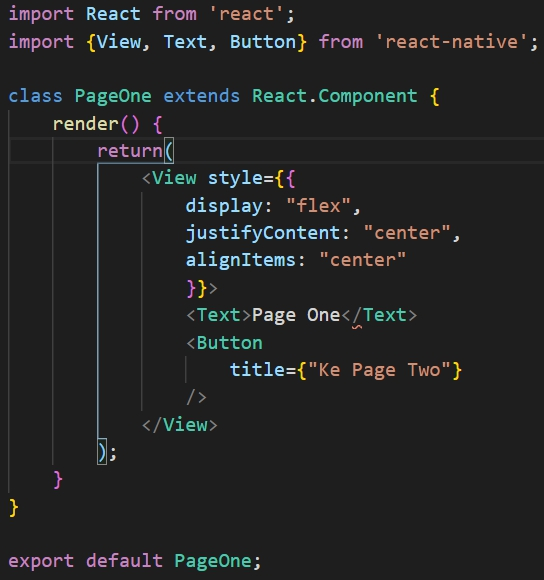
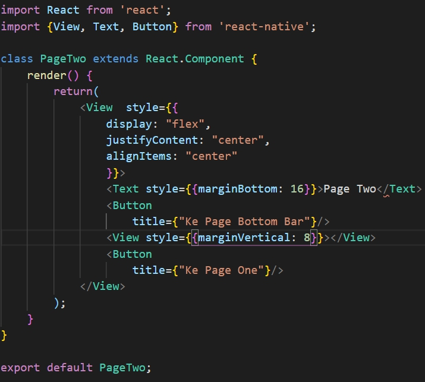

# Tutorial React Native
Tutorial membuat aplikasi mobile dengan menggunakan React Native Expo

## Modul 4 - Navigasi pada React Native
Pada modul ini akan dijelaskan bagaimana cara melakukan navigasi antar project React Native menggunakan 
Expo Managed Workflow.

### Pra - Instalasi
Berikut link dokumentasi dari library react navigation

1.  https://reactnavigation.org/docs/getting-started

### Instalasi Library
Sebelum memulai membuat navigasi, diperlukan instalasi library dengan perintah pada command prompt (Windows) atau terminal seperti berikut.

- Melalui link pada pra instalasi, jalankan perintah berikut 
```shell script
npm install react-native-reanimated react-native-gesture-handler react-native-screens react-native-safe-area-context @react-native-community/masked-view --global expo-cli
```
Perintah diatas akan menginstall library-library berikut.

- Gesture Handler
- Safe Area
- 
Untuk react native 0.6 keatas *linking* sudah secara otomatis, jika menggunakan versi dibawahnya maka ketikkan
```shell script
react native link
```
Apabila ingin develop ke ios juga maka perlu install pods dengan mengetikkan perintah dibawah
```shell script
npx pod-install ios
```
Selain navigasi utama, diperlukan sebuah library lagi untuk membuat navigasi dalam bentuk bottom tab dengan perintah berikut
```
npm install @react-navigation/bottom-tabs --global expo-cli
```
### Persiapan Project
Buat sebuah folder bernama page, lalu buat 5 file pad folder tersebut bernama

- pageOne.js
- pageTwo.js
- pageBarContainer.js
- pageBarOne.js
- pageBarTwo.js
- pageBarThree.js

Alur dari project ini nanti akan seperti berikut 

Lalu isi setiap file yang sudah kita buat sebelumnya seperti berikut. 
   
Kode            | Output
:-------------------------:|:-------------------------:
 PageOne.js|
 PageTwo.js|
 PageBarOne.js|

### Membuat navigasi

### Pustaka
- [Getting Started - React Navigation Documentation](https://reactnavigation.org/docs/getting-started/)
- [Create a new app - Expo Documentation](https://docs.expo.io/get-started/create-a-new-app/)
***
Mobile Innovation Studio - 2020

