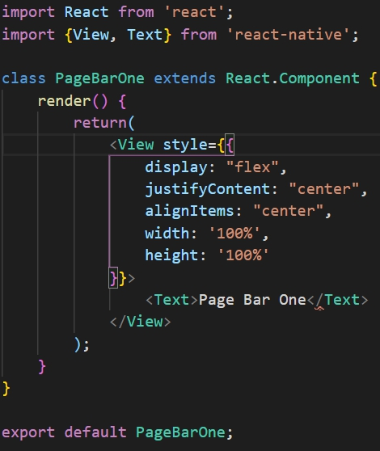
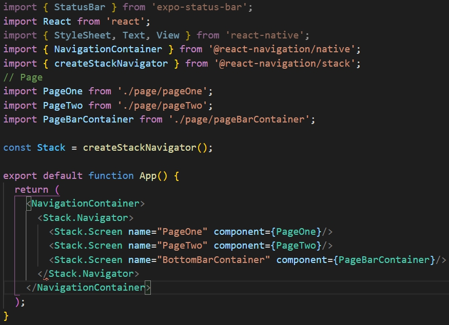
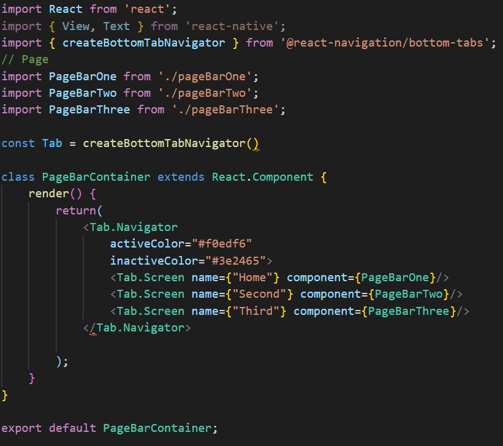

# Tutorial React Native
Tutorial membuat aplikasi mobile dengan menggunakan React Native Expo

## Modul 4 - Navigasi pada React Native
Pada modul ini akan dijelaskan bagaimana cara melakukan navigasi antar project React Native menggunakan 
Expo Managed Workflow.

### Pra - Instalasi
Berikut link dokumentasi dari library react navigation

1.  https://reactnavigation.org/docs/getting-started

### Instalasi Library
Sebelum memulai membuat navigasi, diperlukan instalasi library dengan perintah pada command prompt (Windows) atau terminal seperti berikut.

- Melalui link pada pra instalasi, jalankan perintah berikut untuk menginstall library inti
```shell script
npm install @react-navigation/natives
```

- Kemudian ketikkan perintah berikut
```shell script
npm install react-native-reanimated react-native-gesture-handler react-native-screens react-native-safe-area-context @react-native-community/masked-view --global expo-cli
```
Perintah diatas akan menginstall library-library berikut.

- Gesture Handler
- Safe Area
- 
Untuk react native 0.6 keatas *linking* sudah secara otomatis, jika menggunakan versi dibawahnya maka ketikkan
```shell script
react native link
```
Apabila ingin develop ke ios juga maka perlu install pods dengan mengetikkan perintah dibawah
```shell script
npx pod-install ios
```
Pada navigasi utama digunakan sejenis stack, kita install dengan mengetikkan perintah.
``` shell script
npm install @react-navigation/stack
```
Selain navigasi utama, diperlukan sebuah library lagi untuk membuat navigasi dalam bentuk bottom tab dengan perintah berikut
```
npm install @react-navigation/bottom-tabs
```
### Persiapan Project
Buat sebuah folder bernama page, lalu buat 5 file pad folder tersebut bernama

- pageOne.js
- pageTwo.js
- pageBarContainer.js
- pageBarOne.js
- pageBarTwo.js
- pageBarThree.js

Alur dari project ini nanti akan seperti berikut 

Lalu isi setiap file yang sudah kita buat sebelumnya seperti berikut. 
   
Kode            | Output
:-------------------------:|:-------------------------:
 PageOne.js|
 PageTwo.js|
 Semua PageBar kecuali Page BarContainer|

### Membuat navigasi
1) Pertama <br>
kita buat file app.js sebagai entry point dari alur. Pada dasarnya navigasi pada aplikasi mobile berbentuk stack (first in last out) sehingga semakin dalam kita menuju ke halaman tertentu maka akan banyak halaman yang dilewati untuk menuju dan kembali ke awal. Pada react digunakan stackNavigator dan NavigationContainer dalam implementasi hal ini, berikut implementasinya. 
<br/>


<br/>

<span style="background-color: gray; color: white; padding-left: 5px; padding-right: 5px; border-radius: 5px">createStackNavigator</span> adalah fungsi yang mengembalikan objek dengan 2 properti, <span style="background-color: gray; color: white; padding-left: 5px; padding-right: 5px; border-radius: 5px">Screen</span> dan <span style="background-color: gray; color: white; padding-left: 5px; padding-right: 5px; border-radius: 5px">Navigator</span> dimana navigator untuk melakukan operasi di stack nya sedangkan screen sebagai element.
<br/>
<span style="background-color: gray; color: white; padding-left: 5px; padding-right: 5px; border-radius: 5px">NavigationContainer</span> adalah komponen untuk manajemen pohon navigasi kita dan berisi navigation state. Isi dari Navigator adalah halaman - halaman yang akan kita sambung satu sama lain (secara otomatis halaman tersebut memiliki props navigation)
<br/><br/>
1) Kedua <br>
kita buat file pageBarContainer.js sebagai container (wadah) dari navigasi bottom tab yang terdiri dari 3 halaman pageBar yang sudah kita buat diatas.
Berikut implementasinya.
<br/>


<br/>

TabNavigator memiliki konsep yang sama dengan StackNavigator hanya berbeda fungsi saja. Setelah mengatur dua file tersebut maka output dari kode kita akan seperti berikut.
<br><br>


### Pustaka
- [Getting Started - React Navigation Documentation](https://reactnavigation.org/docs/getting-started/)
***
Mobile Innovation Studio - 2020

