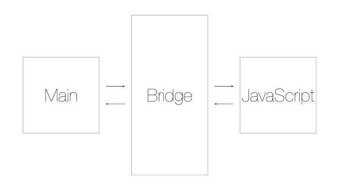

# Tutorial React Native
Tutorial membuat aplikasi mobile dengan menggunakan React Native Expo

## Modul 1 - Pengenalan React Native

### Apa itu React dan React Native?
- React merupakan library javascript yang digunakan untuk membuat User Interface.
- Dikembangkan oleh Facebook.
- React dapat digunakan di multi platform, seperti: website (ReactJS), mobile (React Native), maupun desktop (Electron).
- Saat ini React Native hanya mensupport 2 OS, yaitu Android dan iOS.

### Apa kelebihan React Native?
1. Deklaratif, sehingga mudah untuk dipelajari.
2. Berbasis Komponen, komponen dapat digunakan kembali. 
3. Hanya perlu sekali belajar untuk membuat aplikasi di platform lain.
4. Menggunakan bahasa pemrograman JavaScript.
5. Fast Refresh, menampilkan perubahan tanpa perlu meng-compile ulang kode program.
6. Bukan WebView, react native memetakan javascript ke komponenen UI iOS/Android.

### Apa kekurangan React Native?
1. Limitasi, performa yang terbatas.
2. Hanya sebagai framework UI, sedikit susah apabila ingin mengimplementasi native code.

### Bagaimana cara kerja React Native?

- Terdapat 2 thread utama, yaitu Main Thread dan Javascript Thread.
- Main Thread adalah thread utama dari aplikasi native (iOS/Android) yang digunakan untuk mengatur UI.
- Javascript Thread digunakan untuk mengeksekusi kode javascript (business logic dari aplikasi).
- Kedua thread tidak saling berkomunikasi secara langsung.
- Di antara kedua thread terdapat Bridge yang merupakan core dari React Native.
- Fungsi dari Bridge untuk menjembatani antara Javascript dengan Main Thread sehingga kedua thread dapat saling berkomunikasi.
- Dengan begitu React Native berjalan layaknya aplikasi native.
  

### Pustaka
- [React](https://reactjs.org/)
- [React Native](https://reactnative.dev/)
- [We Talk IT "React Native: What it is and how it works"](https://medium.com/we-talk-it/react-native-what-it-is-and-how-it-works-e2182d008f5e)

***
Mobile Innovation Studio - 2020
